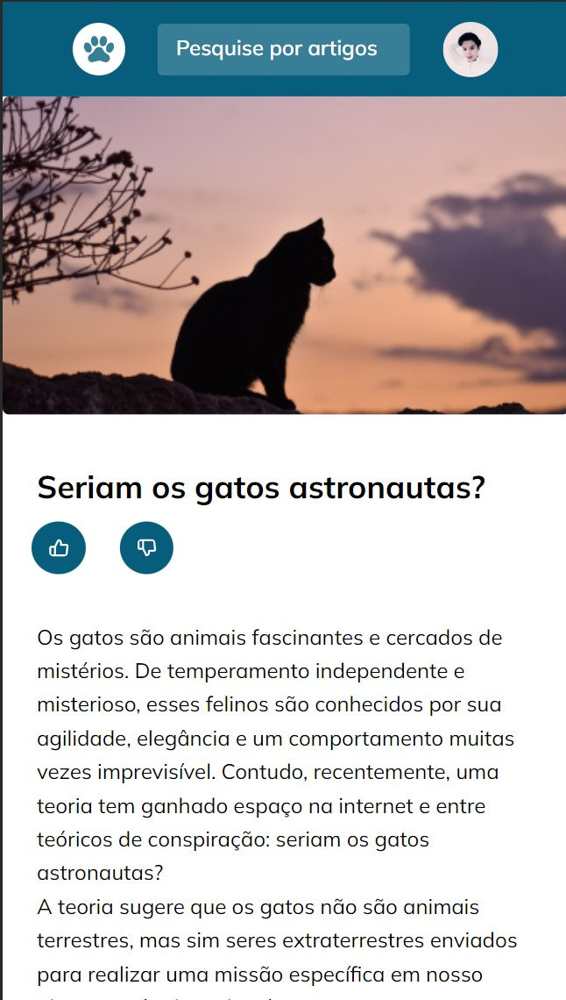

<h1 align="center">Blog de Gatos</h1>

  

Curso exclusivo, promovido pela Rocketseat para ensino de tecnologias WEB.

  <a href="#-tecnologias">Tecnologias</a>&nbsp;&nbsp;&nbsp;|&nbsp;&nbsp;&nbsp;
  <a href="#-projeto">Projeto</a>&nbsp;&nbsp;&nbsp;|&nbsp;&nbsp;&nbsp;
  <a href="#-layout">Layout</a>&nbsp;&nbsp;&nbsp;|&nbsp;&nbsp;&nbsp;
  <a href="#memo-licença">Licença</a>

  

 

## 🚀 Tecnologias

Esse projeto foi desenvolvido com as seguintes tecnologias:

- HTML e CSS
- Git e Github
- Figma

## 💻 Projeto

O Blog de Gatos é o universo intrigante  dos nosso  gatos, o  blog dedicado a esses felinos encantadores. Descubra dicas de cuidados, curiosidades sobre raças e comportamento, e apaixone-se por histórias cativantes. Navegue por fotos irresistíveis e compartilhe a paixão por esses adoráveis ronronadores. Seja bem-vindo ao lugar onde o charme felino encontra seu espaço virtual!

[Link ](https://rafael-malaquias.github.io/Blog-de-gatos/) - Para visualizar o projeto.

## 🔖 Layout

Você pode visualizar o layout do projeto através [DESSE LINK](https://www.figma.com/community/file/1256354927622258124/blog-de-gatos-desafio-explorer). É necessário ter conta no [Figma](https://figma.com) para acessá-lo.

##  📝 Licença

Esse projeto está sob a licença MIT.

---